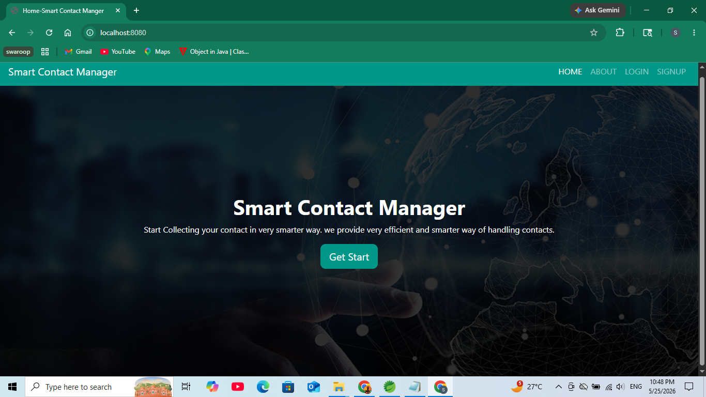
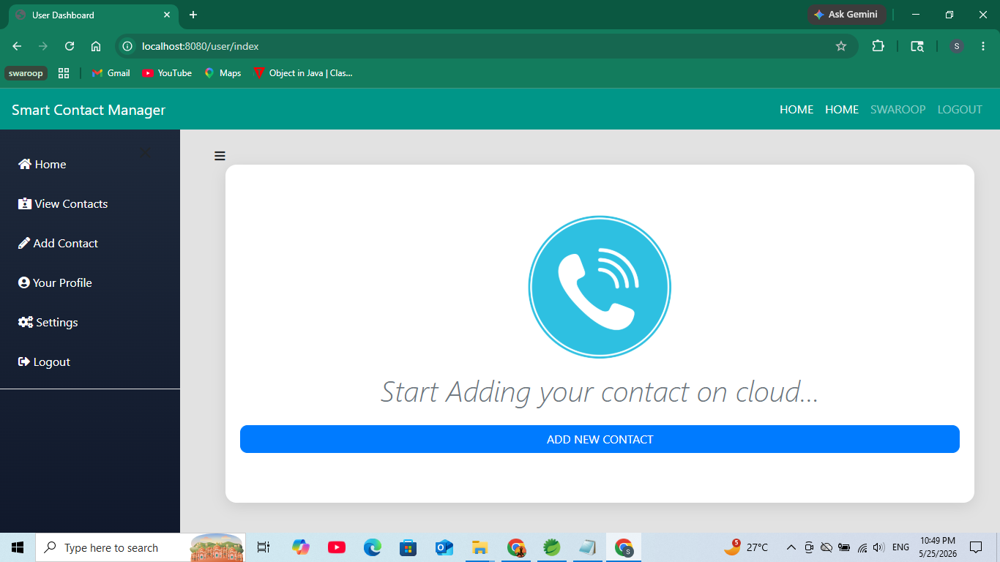
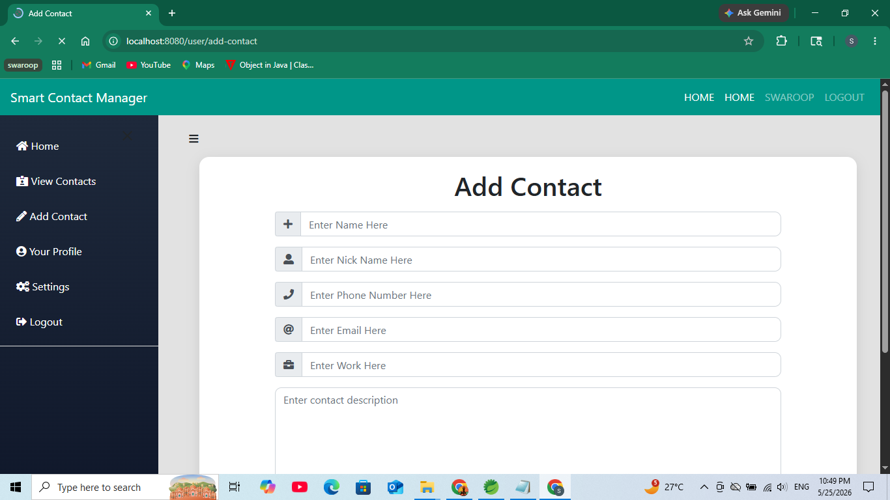
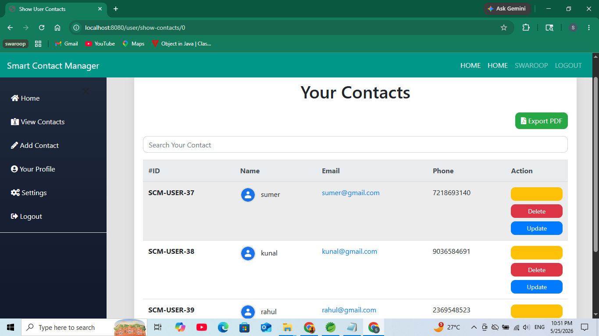

# Smart Contact Manager using Spring Boot

A full-stack web application built using Spring Boot, Spring Security, Thymeleaf, Hibernate, and MySQL that helps users securely manage their personal contacts.

---

## Key Highlights

- Secure Authentication using Spring Security
- Full CRUD Operations
- MVC Architecture
- Responsive User Interface
- MySQL Database Integration

---

# Features

* User Registration & Login
* Secure Authentication using Spring Security
* Add New Contacts
* Update Existing Contacts
* Delete Contacts
* View Contact Details
* User Profile Management
* Search Contacts
* Change Password Functionality
* Responsive UI Design
* Server Side Validation
* Contact Image Upload Support

---

# Technologies Used

## Backend

* Java 11
* Spring Boot
* Spring MVC
* Spring Security
* Spring Data JPA
* Hibernate

## Frontend

* Thymeleaf
* HTML5
* CSS3
* JavaScript
* Bootstrap

## Database

* MySQL

## Build Tool

* Maven

---

# Project Structure

```text
src
└── main
    ├── java/com/smart
    │   ├── config
    │   ├── controller
    │   ├── dao
    │   ├── entities
    │   └── helper
    │
    └── resources
        ├── static
        ├── templates
        └── application.properties
```
---

# Modules

## Authentication Module

* User Signup
* User Login
* Secure Session Management

## Contact Management Module

* Add Contact
* Edit Contact
* Delete Contact
* View Contact
* Search Contact

## User Module

* User Profile
* Change Password
* Settings

---

# Screenshots

## Home Page



## Dashboard



## Add Contact



## Your Contacts



---

# Prerequisites

Make sure you have installed:

- Java 11 or above
- Maven
- MySQL Server
- STS / IntelliJ / Eclipse

---

# How to Run the Project

## 1. Clone Repository

```bash
git clone https://github.com/swaroopkalunge01/SmartContactManager.git
```

## 2. Open Project

Open project in:

* Spring Tool Suite (STS)
* IntelliJ IDEA
* Eclipse

---

## 3. Configure Database

Update `application.properties`:

```properties
spring.datasource.url=jdbc:mysql://localhost:3306/smartcontact
spring.datasource.username=root
spring.datasource.password=yourpassword
```

---

## 4. Run Application

Run:

```bash
mvn spring-boot:run
```

OR run:

```text
SmartContactManagerApplication.java
```

---

# Dependencies Used

* Spring Boot Starter Web
* Spring Boot Starter Security
* Spring Boot Starter Thymeleaf
* Spring Boot Starter Data JPA
* MySQL Connector
* Hibernate Validator
* iText PDF Library

---

# Future Improvements

* Email Verification
* REST API Integration
* React Frontend
* Docker Deployment
* Cloud Hosting
* JWT Authentication

---

# Author

Swaroop Kalunge

---

# Important Files to Ignore

Your `.gitignore` should contain:

```gitignore
target/
*.class
.settings/
.project
.classpath
.idea/
.vscode/
```

---

# Resume Project Description

Smart Contact Manager is a full-stack web application developed using Spring Boot and Thymeleaf that allows users to securely manage personal contacts with authentication, CRUD operations, search functionality, and profile management using MySQL database integration.

---

# Contact

For queries or collaboration:

- Email: swaroopkalunge01@gmail.com
- GitHub: https://github.com/swaroopkalunge01

---

# License

This project is developed for learning and educational purposes.